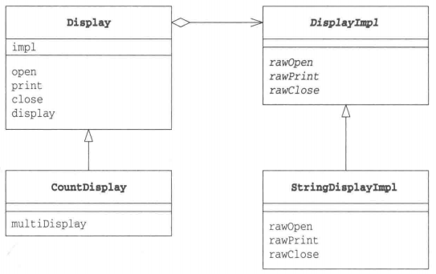

编写子类时，先确认意图：“增加功能”，还是“增加实现”，当类的层次结构只有一层时，功能层次结构与实现层次结构是混在一个层次结构中的。
这样容易使类的层次结构变得复杂，也难以彻底地理解类的层次结构。

| 在桥的哪一侧   |  名字   | 说明    |
|-----|-----|-----|
|  类的功能层次结构   |  Display   |  负责显示的类   |
|  类的功能层次结构   |  CountDisplay   | 增加了"只显示规定次数"这一功能的类    |
|  类的实现层次结构   |  DisplayImpl   |   负责显示的类  |
|  类的实现层次结构   |  StringDisplayImpl   | "用字符串显示"的类    |

